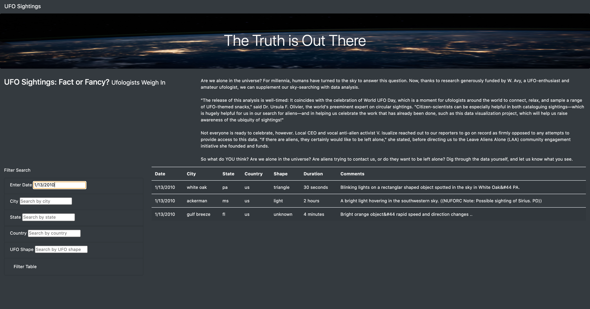

# JavaScript and HTML
The purpose of this project was to help Dana create an interactive webpage that allows readers to parse the data around UFO sightings. So we built: A webpage to allow users to view the data using HTML, and A table that presents the data using JavaScript.

# Filters
Then we create the table for filters of:
1. Date
2. City
3. State
4. Country
5. Shape

# Technologies used
VS Code, javascript, css, html and bootstrap

# Webpage 

# Recommendation 
Maybe in the future, we could add more links for more information, more photos or vedios than just words showing on the page, that would more attractive to people.

